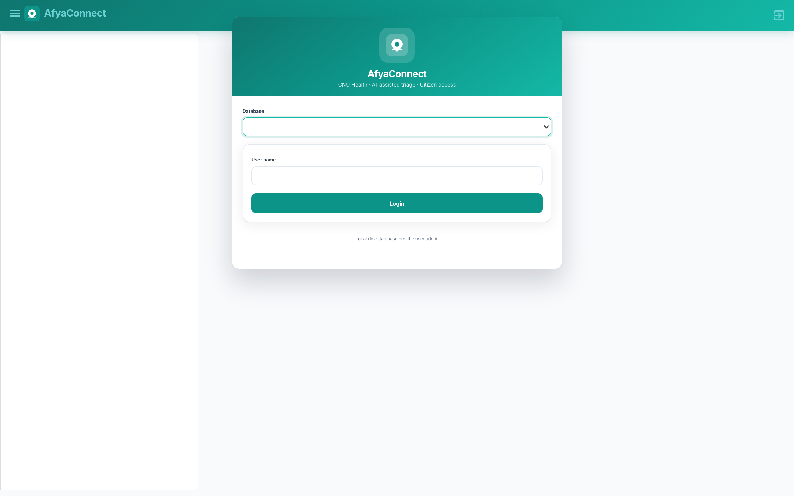
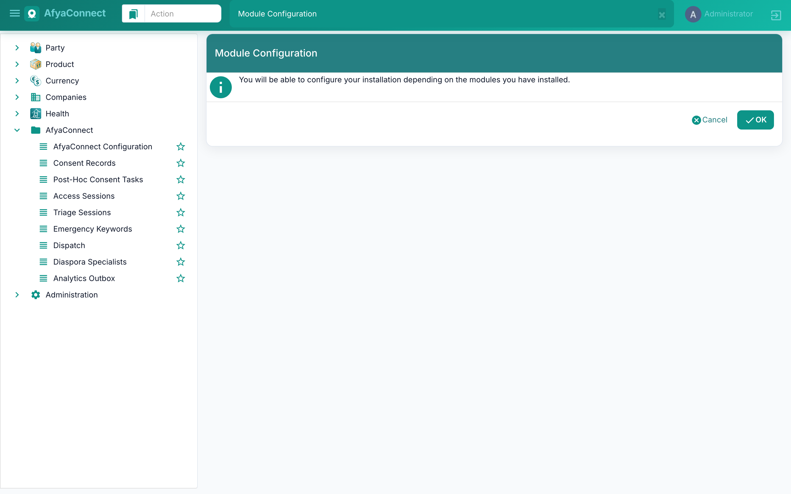
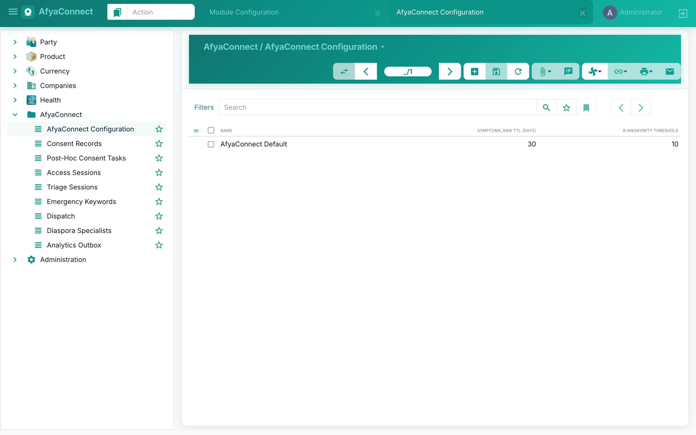
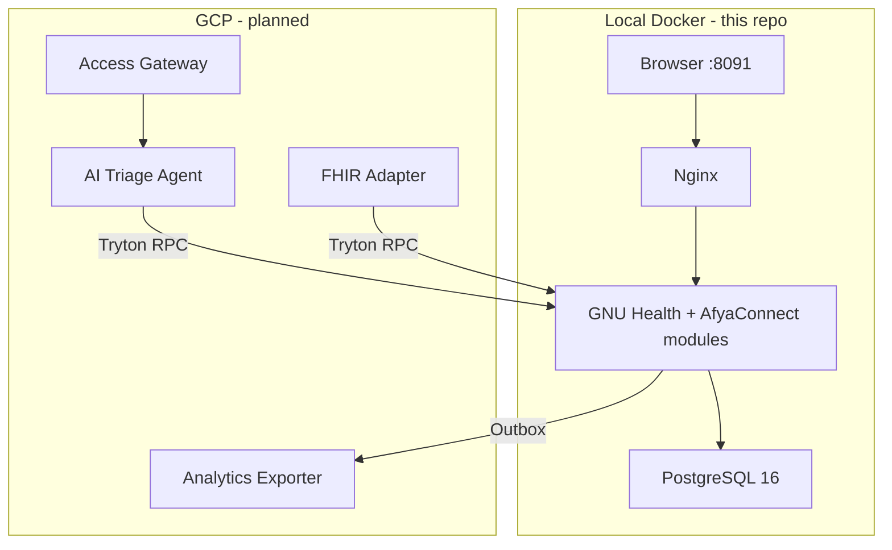

# AfyaConnect × GNU Health

[](LICENSE)

**AfyaConnect** is a hybrid healthcare platform that connects citizens (voice, SMS, USSD) to AI-assisted triage and GNU Health clinical workflows. This repository contains the **local development stack**: GNU Health 5.x on Docker, six AfyaConnect Tryton modules, seed data for Gombe State, and the spec-driven development (SDD) artifacts for the full platform.

Maintained by [sat-found](https://github.com/sat-found/).

## Screenshots

| Login | Dashboard |
|-------|-----------|
|  |  |

| Triage Sessions | Configuration |
|-----------------|---------------|
|  |  |

The web client uses a custom **AfyaConnect theme** (teal palette, Inter typography, branded login) layered on Tryton SAO via `gnuhealth/sao-branding/`.

---

## What is in this repository?

| Layer | Status | Location |
|-------|--------|----------|
| GNU Health 5.x (Tryton 7.0) | **Running locally** | `gnuhealth/` Docker image |
| AfyaConnect Tryton modules (`z_health_afya_*`) | **Phase 1 core + security** | `gnuhealth/z_health_afya_*/` |
| Mosquito Registration (vector surveillance) | Included | `gnuhealth/mosquito_registration/` |
| Gombe seed data (facilities, patients, workers, keywords) | **Runnable** | `gnuhealth/seed/seed_gombe.py` |
| SDD specs, constitution, model inventory | **Committed** | `specs/` |
| Cloud Run services (Gateway, Triage Agent, FHIR, Analytics) | Planned | `services/` |
| GCP bootstrap scripts | Planned | `setup/` |

Future Cloud Run services and GCP deployment are documented in [docs/afyaconnect/GCP_AND_AT_SETUP.md](docs/afyaconnect/GCP_AND_AT_SETUP.md). Local Docker is the starting point.

---

## Architecture



Citizen channels (SMS, USSD, voice) and AI services will run on GCP Cloud Run. GNU Health remains the **system of record** for triage, dispatch, consent, and analytics outbox events.

---

## Prerequisites

| Requirement | Details |
|-------------|---------|
| Docker Desktop | Installed and running |
| RAM | 8 GB+ allocated to Docker |
| Disk space | ~5 GB for images and volumes |
| Git | To clone this repository |

Verify Docker:

```bash
docker info
```

---

## Quick start

### 1. Clone

```bash
git clone https://github.com/sat-found/afyaconnect.git
cd afyaconnect
```

### 2. Configure environment

```bash
cp gnuhealth/env.template .env
```

Default values work for local development. No secrets required for the local stack.

### 3. Build and start

```bash
./scripts/start.sh
```

The **first run** builds Docker images and activates GNU Health + AfyaConnect modules. This typically takes **20–40 minutes**. Subsequent starts are much faster.

Watch progress:

```bash
./scripts/logs.sh app
```

Wait until you see `[uWSGI]` startup lines and no traceback errors.

### 4. Open the web UI

**http://localhost:8091**

Port 8091 avoids conflict if the gnu-heath stack is already running on 8090.

| Field | Value |
|-------|-------|
| Database | `health` |
| Username | `admin` |
| Password | `gnusolidario` |

### 5. Seed Gombe demo data (optional)

Loads 50 facilities, 200 synthetic patients, 20 health workers, and 52 emergency keywords:

```bash
./scripts/seed-gombe.sh
```

Data is idempotent — re-running skips records that already exist.

### 6. Stop

```bash
./scripts/stop.sh
```

Data persists in Docker volumes across restarts.

---

## AfyaConnect modules

After startup, verify modules under **Administration → Modules** (all should show *Activated*):

| Module | Purpose |
|--------|---------|
| `z_health_afya_core` | Config, consent model, shared utilities |
| `z_health_afya_access` | Access sessions (SMS/USSD/voice) |
| `z_health_afya_triage` | Triage sessions, emergency keywords |
| `z_health_afya_dispatch` | Emergency dispatch (extends EMS support requests) |
| `z_health_afya_diaspora` | Diaspora specialist matching |
| `z_health_afya_analytics` | Analytics outbox for BigQuery export |

In the UI, open the **AfyaConnect** menu to see scaffold views for each module.

Also activated: `health_ems`, `health_icd10`, `health_federation`, `health_crypto`, `health_reporting`.

---

## Project layout

```
afyaconnect/
├── docker-compose.yml          # PostgreSQL + GNU Health app + Nginx
├── .env                        # Local config (copy from gnuhealth/env.template)
├── gnuhealth/
│   ├── Dockerfile              # GNU Health 5.x + AfyaConnect modules
│   ├── init_and_run.sh         # DB init, module activation, uWSGI
│   ├── sao-branding/           # AfyaConnect web UI theme (custom.css/js)
│   ├── env.template            # Environment variable reference
│   ├── mosquito_registration/  # Vector surveillance module
│   ├── z_health_afya_core/     # AfyaConnect core module
│   ├── z_health_afya_access/
│   ├── z_health_afya_triage/
│   ├── z_health_afya_dispatch/
│   ├── z_health_afya_diaspora/
│   ├── z_health_afya_analytics/
│   └── seed/
│       └── seed_gombe.py       # Gombe State synthetic data
├── specs/
│   ├── constitution.md         # SDD constitution, gates, licensing
│   ├── gnuhealth-model-inventory.md  # G0 gate — model reconciliation
│   └── z_health_afya_*/        # Per-module spec stubs
├── services/                   # Future Cloud Run services (Apache 2.0)
├── setup/                      # Future GCP bootstrap scripts
├── docs/
│   ├── LOCAL_SETUP.md          # Detailed setup and troubleshooting
│   └── afyaconnect/
│       └── GCP_AND_AT_SETUP.md # GCP + Africa's Talking guide
├── scripts/
│   ├── start.sh
│   ├── stop.sh
│   ├── status.sh
│   ├── logs.sh
│   └── seed-gombe.sh
└── web-site/
    └── reverse_proxy.conf
```

---

## Helper scripts

| Script | Purpose |
|--------|---------|
| `./scripts/start.sh` | Build (if needed) and start all services |
| `./scripts/stop.sh` | Stop containers, preserve data |
| `./scripts/status.sh` | Show container status |
| `./scripts/logs.sh [service]` | Follow logs (`app`, `db`, or `web`) |
| `./scripts/seed-gombe.sh` | Load Gombe synthetic demo data |
| `node scripts/screenshot-ui.mjs` | Capture README screenshots (requires Playwright) |

---

## Development workflow

### Rebuild after code changes

```bash
docker compose down
docker compose up -d --build
```

If you only changed the seed script:

```bash
docker compose cp gnuhealth/seed/seed_gombe.py app:/opt/gnuhealth/seed/seed_gombe.py
./scripts/seed-gombe.sh
```

### Reset all data (fresh start)

```bash
docker compose down -v
./scripts/start.sh
./scripts/seed-gombe.sh
```

### Verify modules in the database

```bash
docker compose exec db psql -U gnuhealth -d health -c \
  "SELECT name, state FROM ir_module WHERE name LIKE 'z_health_afya%' ORDER BY name;"
```

---

## Configuration

Environment variables in `.env`:

```env
GNUHEALTH_DB_HOST="db"
GNUHEALTH_DB_PORT=5432
GNUHEALTH_DB_USERNAME=gnuhealth
GNUHEALTH_DB_PW=gnusolidario
GNUHEALTH_DB_NAME=health
GNUHEALTH_ADMIN_MAIL=example@example.com
GNUHEALTH_ADMIN_PW=gnusolidario
GNUHEALTH_DEMO_DB=true
```

To change the web port, edit `docker-compose.yml`:

```yaml
ports:
  - "8090:80"
```

---

## Spec-driven development

AfyaConnect follows **Spec-Driven Development (SDD)** with three execution gates:

| Gate | Condition | Blocks |
|------|-----------|--------|
| **G0** | `specs/gnuhealth-model-inventory.md` approved | Module business logic (Phase 1+) |
| **G1** | End-to-end demo path works locally | Voice and diaspora (Phase 5) |
| **G2** | All acceptance tests pass | Demo prep (Phase 6) |

Key documents:

- [specs/constitution.md](specs/constitution.md) — licensing, gates, PRD deviations, safety
- [specs/gnuhealth-model-inventory.md](specs/gnuhealth-model-inventory.md) — G0 model reconciliation
- [docs/afyaconnect/GCP_AND_AT_SETUP.md](docs/afyaconnect/GCP_AND_AT_SETUP.md) — GCP and Africa's Talking setup (deferred)

---

## Troubleshooting

| Problem | Solution |
|---------|----------|
| Docker is not running | Start Docker Desktop and wait until ready |
| Port 8091 in use | Run `lsof -i :8091` and change port in `docker-compose.yml` |
| Login fails / Application Error | Use database `health`, user `admin`, password `gnusolidario`; rebuild if password was never set |
| FORBIDDEN / Bad Gateway on login | Use `http://localhost:8091`, hard-refresh, database `health` |
| 502 Bad Gateway after start | App still initializing — wait 5–15 min, check `./scripts/logs.sh app` |
| Module activation failed | Check app logs for traceback; rebuild with `docker compose up -d --build` |
| Seed script federation error | Ensure `fsync=False` and `fed_country='NGA'` (already set in seed script) |

See [docs/LOCAL_SETUP.md](docs/LOCAL_SETUP.md) for the full guide.

---

## Relationship to gnu-heath

This repository started from [sat-found/gnu-heath](https://github.com/sat-found/gnu-heath), the GNU Health local Docker development stack. AfyaConnect extends that foundation with:

- Six `z_health_afya_*` Tryton modules
- Expanded GNU Health module activation (EMS, ICD-10, federation, crypto, reporting)
- Gombe State seed data
- SDD specs and deferred GCP/service scaffolding

The underlying GNU Health stack (PostgreSQL, Tryton, SAO web client, Nginx) is unchanged.

---

## Roadmap (high level)

| Phase | Focus | Status |
|-------|-------|--------|
| 0 | Local foundation, module scaffolds, G0 inventory | **Done** |
| 1 | Core module (consent, security PoC), triage workflow | **Current** (`feature/phase-1-core-security`) |
| 2 | Access + triage data layer, Access Gateway | Planned |
| 3 | AI triage end-to-end (Vertex AI + WHO RAG) | Planned |
| 4 | Dispatch + analytics pipeline | Planned |
| 5 | Voice + diaspora (demotable) | After G1 |
| 6 | Integration, validation, demo | After G2 |

---

## References

- [GNU Health documentation](https://docs.gnuhealth.org/his)
- [GNU Health project](https://www.gnuhealth.org/)
- [Tryton framework](https://www.tryton.org/)
- AfyaConnect DevPlan v5 (internal SDD reference in `specs/`)

---

## License

| Component | License |
|-----------|---------|
| GNU Health (upstream) | GPL-3.0 |
| `z_health_afya_*` Tryton modules | GPL-3.0-or-later |
| Mosquito Registration module | GPL-3.0-or-later |
| Cloud Run services (`services/`) | Apache 2.0 (when implemented) |
| Bootstrap scripts (`setup/`) | Apache 2.0 (when implemented) |

This project is licensed under the [GNU General Public License v3.0](LICENSE).
